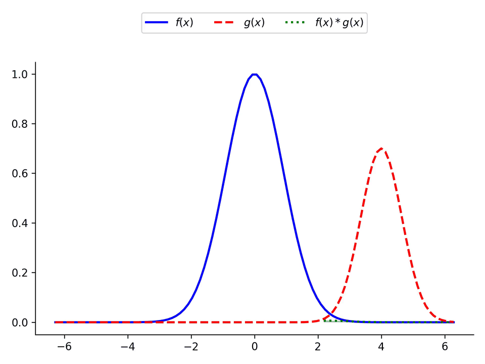
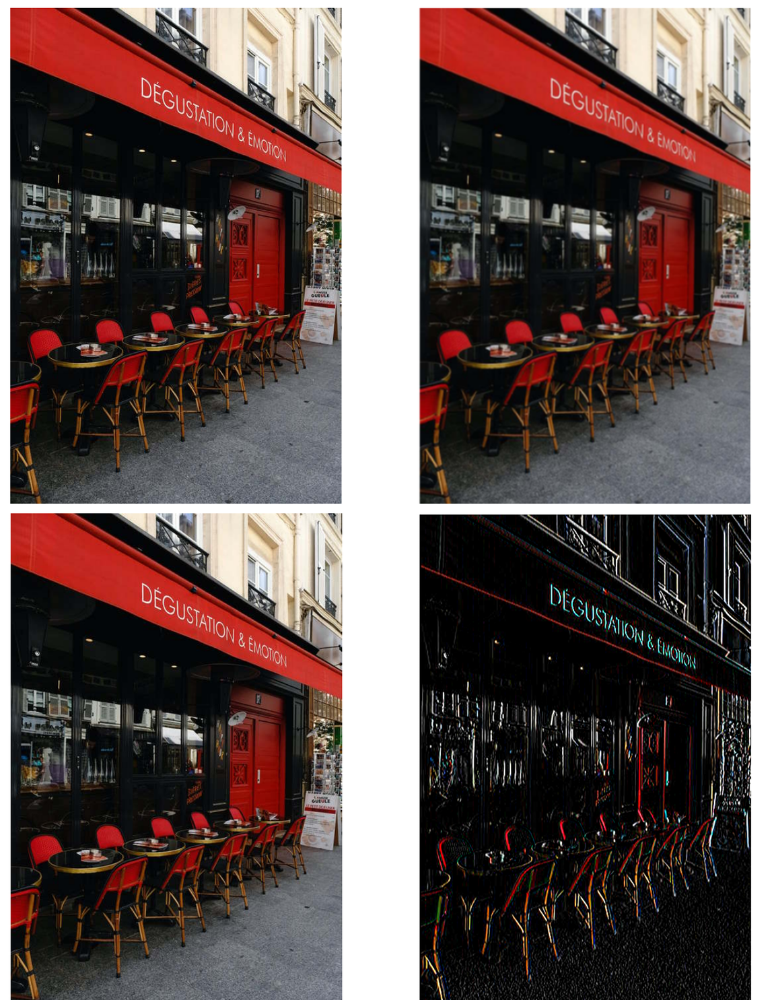
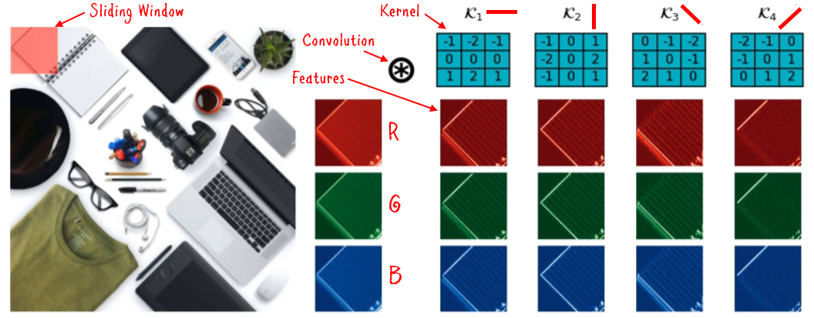

# Understanding Convolution and Feature Extraction in Deep Networks

# 1D Convolutions

 
 

# 2D Convolutions

# Feature Extraction

# Visualization Tool

## Requirements

* Python 3
* Numpy

## Running The Notebook

* Open the Notebook in Google Colab or local jupyter server
* Install the requirements
* Restart the kernel if necessary 

## The tutorial 📃

The full tutorial is available on following links:

On Medium:

https://azad-wolf.medium.com/why-convolve-understanding-convolution-and-feature-extraction-in-deep-networks-ee45d1fdd17c

On Substack:

https://azadwolf.substack.com/

